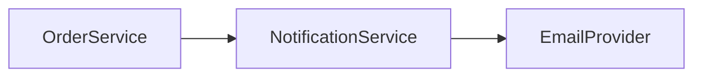

# Design — Reference

## Architecture outline

```markdown
## Overview
## Components
## Data flow
## Interfaces
## AC coverage map

| AC ID | Design section |
|-------|----------------|
| AC-001 | §3 Notification flow |
```

## Example mermaid



## Tradeoff template

```markdown
## Decision: Sync vs async email dispatch

**Options:** (A) sync in ship handler (B) async queue
**Chosen:** B
**Rationale:** Ship API latency SLO < 200ms; email provider SLA independent
**Rejected:** A — violates latency under provider slowdown
```
