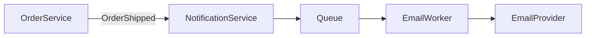

# Architecture — Ship notification

## Overview

Order service publishes `OrderShipped` event. Notification service consumes, enqueues email job. Worker sends via email provider.

## Components

- **OrderService** — emits ship event
- **NotificationService** — queue producer + idempotency store
- **EmailWorker** — consumes queue, calls provider
- **EmailProvider** — external API

## Data flow

## AC coverage

| AC ID | Section |
|-------|---------|
| AC-001 | Notification flow §2 |
| AC-002 | Email template §3 |
| AC-003 | Idempotency §4 |

## Idempotency

Dedupe key: `order_id` + `event_type=shipped` in Redis before enqueue.
